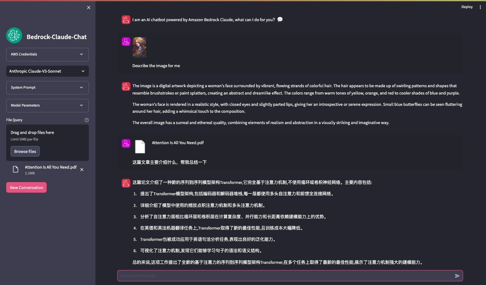

# Streamlit Chat App for AWS Bedrock Foundation Models

A feature-rich chat interface for AWS Bedrock foundation models with support for multimodal inputs, reasoning modes, and optional MCP (Model Context Protocol) tool calling.

## 🚀 Quick Start

### Prerequisites
- Valid AWS credentials with Bedrock access
- Python 3.8+

### Installation

```bash
# Clone the repository
git clone <repo-url>
cd <repo-folder>

# Install dependencies
pip install -r requirements.txt

# Run the application
streamlit run bedrock_streamlit_converseAPI.py
```

## ✨ Features

- **Multi-Model Support**: Amazon Nova, Anthropic Claude, DeepSeek, Qwen models
- **Multimodal Capabilities**: Text, images, documents, and video (model-dependent)
- **Reasoning Mode**: Extended thinking for Claude and Qwen models
- **Configurable Parameters**: Temperature, top-p, top-k, max tokens
- **AWS Credential Management**: Environment variables, shared credentials, or manual input
- **Cross-Region Support**: US-based region inference profiles
- **MCP Integration** (Optional): Tool calling with external services

## 📝 Configuration

### Adding New Models

Simply edit `models_config.json` - no code changes needed:

```json
"Your Model Name": {
  "model_id": "your.model.id",
  "max_tokens": 4096,
  "supports_multimodal": true,
  "supports_video": false,
  "supports_reasoning": false,
  "supports_tools": true,
  "top_k_max": 500,
  "model_family": "your_family",
  "supports_top_k": true,
  "supports_top_p": true
}
```

The model will automatically appear in the UI dropdown after saving.

### Configuration Files
- `models_config.json` - Model definitions and capabilities
- `config_manager.py` - Configuration management utilities
- `mcp.json` - MCP server configurations (optional, see below)

## 🔧 MCP Integration (Optional)

Enable tool calling capabilities through **Model Context Protocol (MCP)** to let AI interact with external services.

### Setup

1. **Copy example configuration**:
   ```bash
   cp mcp.json.example mcp.json
   ```

2. **Edit `mcp.json`** with your server configurations (see `mcp.json.example` for detailed examples)

3. **Install uv** (for local servers):
   ```bash
   curl -LsSf https://astral.sh/uv/install.sh | sh
   ```

4. **Restart the app** to load MCP servers

### Connection Types

- **stdio** (Local): Command-line servers - requires `command` + `args`
- **http** (Remote): HTTP servers - requires `url` (recommended for remote)
- **sse** (Remote): Server-Sent Events - requires `url` + `"connection_type": "sse"` (legacy)

### Usage

Once configured, ask questions naturally:
- "Search for Python repositories on GitHub"
- "Read the AWS documentation for S3 bucket policies"

The AI automatically selects and uses appropriate tools. View server status in the sidebar.

**Resources**: [MCP Docs](https://modelcontextprotocol.io/) | [Available Servers](https://github.com/modelcontextprotocol/servers)

## 📋 Important Notes

- **AWS Credentials**: Uses standard boto3 credential chain ([environment variables](https://boto3.amazonaws.com/v1/documentation/api/latest/guide/credentials.html#environment-variables) or [shared credentials file](https://boto3.amazonaws.com/v1/documentation/api/latest/guide/credentials.html#shared-credentials-file)). You can also provide credentials manually via the UI.
- **Cross-Region Inference**: For US-based region profiles, ensure model access is enabled in those regions first.
- **MCP**: Optional feature - the app works perfectly without it for standard chat functionality.
- **File Support**: Image, document, and video understanding depends on model capabilities.

## 📸 Screenshots



## 📁 Project Structure

```
├── bedrock_streamlit_converseAPI.py  # Main application
├── config_manager.py                 # Configuration management
├── models_config.json                # Model definitions
├── mcp_client.py                     # MCP client (optional)
├── mcp_config.py                     # MCP configuration (optional)
├── tool_handler.py                   # Tool execution (optional)
├── stream_tools_sync.py              # Streaming with tools (optional)
├── asyncio_loop_manager.py           # Async event loop (optional)
├── archived/                         # Legacy implementations
└── utils/                            # UI assets
```  

> All codes including documents are developed by [Kiro](https://kiro.dev/) base on [bedrock-streamlit-chat repo](https://github.com/terrificdm/bedrock-streamlit-chat)